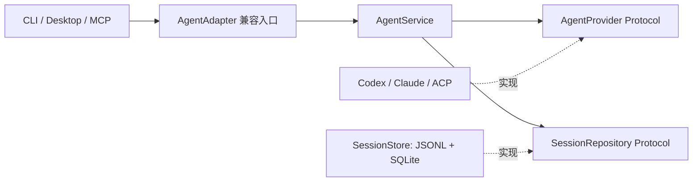

# Cleo 产品架构

本文面向集成方和贡献者，描述 Cleo 已实现的产品边界、运行时、harness adapter、session storage 与 memory pipeline。阅读后应能够判断一个请求由哪个入口处理、数据写到哪里、provider 如何扩展，以及哪些投影可以安全重建。

Cleo 的架构目标是：本地数据可控、不同 agent 体验一致、会话可以恢复、长期记忆可以回查证据。本文不把规划能力写成已完成能力。

## 产品上下文

```text
User
 ├── Cleo Desktop ── Electron/React ── JSONL IPC ─┐
 ├── Cleo CLI/TUI ────────────────────────────────┤
 └── MCP client ── stdio ─────────────────────────┤
                                                   ▼
                                         Python application core
                                           ├── Cleo Chat → LLM API
                                           └── Productivity → external harness
                                                   │
                                                   ▼
                                         local session + memory data
```

- Desktop 和 CLI 是同一产品核心的两个呈现层，不维护两套业务数据。
- Cleo Chat 使用配置的 chat model；Productivity 通过 adapter 连接 Codex、Claude SDK 或 ACP agent。
- Cleo 不提供托管账户、远程数据库或 HTTP 服务。外部网络流量来自用户选择的模型、搜索、浏览器或 harness provider。

## 组件边界

```text
Cleo CLI / Main Agent
        │
        ├── non_productivity session
        │
        ├── AgentAdapter ── Codex / Claude SDK
        │        │
        │        └───────── ACP harness
        │
        ▼
SessionStore
        ├── manifest.json
        ├── events.jsonl
        ├── compact.json
        └── sessions.sqlite3
                │
                ▼
        DreamAgent / Retrieval
```

- `cleo/agents/cleo.py`：前台 Cleo Agent；`cleo/agents/dream.py`：后台记忆整理 Agent。
  两者可调用的工具集中在 `cleo/agents/tools/`。
- `cleo/cli/application.py`：只负责参数解析和顶层 dispatch；根目录 `main.py` 只保留
  `python main.py` 兼容入口。
- `cleo/cli/chat.py` 与 `cleo/cli/productivity.py`：分别负责主聊天和 harness 的后端编排；
  `cleo/cli/chat_tui.py` 与 `cleo/cli/productivity_tui.py` 提供两套 Textual 全屏交互界面。
- `cleo/cli/productivity_history.py`：把 Codex native turns 或 Cleo event log 规范化为可恢复的
  transcript；恢复 native thread 与历史显示相互独立，显示失败不会阻断 session resume。
- `cleo/cli/lifecycle.py`：session 保存与 DreamAgent consolidation 生命周期。
- `cleo/cli/console.py`：一次性命令的紧凑 Rich 输出；共享 harness event 投影与
  非交互渲染位于 `cleo/cli/productivity_renderer.py`。
- `cleo/images/`：可替换 PNG 的加载与自动裁剪、终端图像选择、动态像素回退和 Sixel 渲染。
- `cleo/sessions/store.py`：session manifest、append-only events 和全局 registry。
- `cleo/sessions/hub.py`：合并 Cleo-managed session 与原生 harness session；不依赖 CLI。
- `cleo/memory/`：compact projection、长期记忆、evidence、路径与 consolidation state。
- `cleo/runtime/state.py`：当前 CLI space/project/thread 和 recent threads；
  `cleo/runtime/usage.py`：共用 context-window usage。
- `cleo/harnesses/`：provider-neutral harness API、控制面和 session adapter。
- `cleo/integrations/harnesses/`：Codex、Claude 和 ACP provider 实现及 composition factory。
- `cleo/integrations/git.py`：只读 Git 状态；`cleo/integrations/codex.py`：兼容 Codex facade。
- `cleo/config/`：配置模型、加载逻辑和打包模板；`cleo/mcp/`：stdio MCP 入口。

依赖方向保持为 `cli → agents / sessions / runtime / integrations`，session persistence
可以依赖 memory projection，但 session 聚合和 Git 集成不反向依赖 CLI。目录重排不改变
运行流：CLI 仍构造相同的 Agent、adapter、SessionStore 和 Runtime，并沿用原有入口、
配置格式与持久化协议。

## Domain、application 与 infrastructure

保留按功能组织的目录，在模块层面区分职责：

| 层 | 模块 | 职责 |
| --- | --- | --- |
| Domain / contracts | `harnesses/models.py`、`control.py`、`provider.py`；`sessions/ports.py`、`policy.py` | 会话与事件类型、provider / repository 接口、无 I/O 的会话内容规则 |
| Application | `harnesses/service.py::AgentService` | 创建、恢复、执行、取消和关闭会话；接收 provider 与持久化接口 |
| Infrastructure | `integrations/harnesses/`、`sessions/store.py`、`integrations/background.py`、`integrations/workspace.py` | SDK、JSONL / SQLite、后台进程、文件系统与 Git |
| Presentation | `cli/`、`desktop/projection.py`、`ui/src/components/` | 终端与桌面呈现 |
| Composition / compatibility | `harnesses/adapter.py`、`integrations/harnesses/factory.py`、Desktop / CLI 入口 | 构造具体实现并接入应用服务 |



这里的 `Protocol` 就是 Python 的接口契约：实现方只需提供约定的方法签名，不要求继承
某个框架基类。`SessionRepository` 只包含 harness 用例实际使用的持久化操作，不暴露
数据库连接或存储目录；`SessionStore` 继续负责现有磁盘格式和派生投影。可选的 provider
控制能力仍按需探测，不要求所有 provider 实现 Codex 专属功能。

`AgentService` 不构造存储或 SDK。原有 `AgentAdapter(project_root, ...)` 保留默认本地
存储和 `register_acp` 便捷方法，因此已有调用方无需迁移。新增核心逻辑应写进 service，
新增具体 provider 的装配写进 factory。工作目录验证仍是应用服务的输入边界。

Desktop 不再导入 CLI：共享的事件 payload / usage 投影位于 `harnesses/events.py`，后台
进程和工作目录操作位于 `integrations/`。CLI 保留原导入入口。前端的装配点显式返回
`CleoClient` 接口，由 IPC 和 mock 两个实现满足同一契约。

这次分层聚焦 harness 与跨入口共享边界；`agents/` 的 LangGraph 装配、memory persistence
和 `Runtime` 的 JSON 读写仍是现有实现，不能把整个 Python 包视为纯 domain。

## 安装与运行目录

源码 checkout 保持现有行为：当 `cleo/config/settings.py` 能在源码根目录看到
`pyproject.toml` 时，相对目录仍以仓库根目录为基准。

Windows 桌面下载包使用分离布局：

```text
%LOCALAPPDATA%\Programs\Cleo\   # Electron 应用、独立 Python/Node runtime
%LOCALAPPDATA%\Cleo\            # config、data、memory、models、skills、workspace
%USERPROFILE%\.codex\           # Codex 自己管理的认证与 task 历史
```

Electron 主进程通过 `CLEO_HOME` 明确指定数据根目录，并从包内 defaults 只补齐缺失文件。
下载更新只替换经过 SHA256 校验的程序目录，不覆盖用户数据；Docker 显式设置
`CLEO_HOME=/app`，并继续通过 volume 持久化运行数据。升级程序不会覆盖已有配置
或用户数据，卸载默认也保留数据目录。源码 checkout 与桌面包的数据目录互不耦合。

## Space 与 Project

每个 session 都必须同时绑定：

```text
space + project + session_id
```

当前 space 为：

- `non_productivity`：Cleo 主聊天、个人上下文、长期偏好和一般计划。
- `productivity`：Codex、Claude、ACP 等 harness 的工程任务与执行记录。

同名 project 在两个 space 中仍然是不同的数据边界。SQLite 查询、compact 校验、
DreamAgent 工具和 evidence 都必须携带 space，避免 productivity 内容自动进入个人记忆。
全局人格是唯一例外，但只允许跨 scope 传播抽象的互动倾向，不能携带任一 scope 的事实。

Cleo 主模式中的 project 是可选的逻辑记忆边界，可表示一个长期话题、计划或工作流，
并不要求存在代码目录；`general` 是默认边界。Productivity UI 则把规范化 `cwd` 当成
用户可见的项目身份，项目选择器只列出最近工作目录，不混入 Cleo 记忆 project 或
Codex native thread。内部 session 的 `project` 字段仍用于 Cleo 侧记录分区，默认取
工作目录名；harness 的真实代码边界始终由 `cwd`/仓库决定。

Cleo thread 的标题由首条 `user_message` 确定，也可作为纯 metadata 手动修改。
活跃且尚未 consolidation 的 thread 可以迁移 project：session 目录、manifest、event
绑定、SQLite registry、compact、memory state 与 conversation chunks 会一起转移。
一旦 source 已被 DreamAgent consolidation，迁移会被拒绝，以免旧 project 的长期记忆
无法可靠回收。

## Session 存储

```text
memory/
├── MEMORY_POLICY.md
├── persona.sqlite3
├── sessions.sqlite3
├── non_productivity/
│   ├── memory.sqlite3
│   ├── memory_state.json
│   └── projects/<project>/
│       ├── MEMORY.md
│       └── sessions/<session_id>/
│           ├── manifest.json
│           ├── events.jsonl
│           └── compact.json
└── productivity/
    ├── memory.sqlite3
    ├── memory_state.json
    └── projects/<project>/
        ├── MEMORY.md
        └── sessions/<session_id>/
            ├── manifest.json
            ├── events.jsonl
            └── compact.json
```

### Manifest

`manifest.json` 是可变的当前状态投影，记录 title、provider、native session ID、
owner、status、cwd、event sequence、source hash 和更新时间。更新使用临时文件加原子
替换。

### Event Log

`events.jsonl` 是权威记录，只追加不覆盖。每行包含全局 event ID、严格递增 seq、
space/project/session 绑定、actor、type、时间和 payload。

流式 token 只发送给实时调用者；完成后的语义消息才持久化。工具调用、权限、文件变化、
计划、状态和错误以独立规范事件保存。大型输出应使用 `data/session_artifacts/`，event
只保存引用。

### Compact Projection

`compact.json` 是可重建派生层：

- 从 `events.jsonl` 读取 semantic events。
- 合并 tool call/result。
- 脱敏 secret 与大型参数。
- 省略低价值读取结果和超长终端内容。
- 保存 `source_content_hash`、event range 和 `source_event_ids`。

加载 compact 时必须重新计算 event hash，并校验 space/project/session 和最后 seq。

### SQLite

`memory/sessions.sqlite3` 是所有 session 的全局 metadata registry，可由 manifest 重建。
每个 space 自己的 `memory.sqlite3` 保存 atomic memory、event evidence、consolidation
记录与 lexical conversation chunks。SQLite 不是原始对话事实源。

`memory/persona.sqlite3` 是唯一的跨 project/space 记忆库，只保存人格 trait 及其私有
event evidence。根目录 `PERSONA.md` 是其不暴露 project/session 来源的可读投影，并由
前台 Cleo 作为低权限描述性记忆加载。

## Harness 事件适配

不同 harness 的原生输出先在 provider adapter 中翻译：

```text
native provider event
    → provider-specific translator
    → Cleo canonical event
    → SessionStore
```

公共语义包括：

- `assistant_message`
- `tool_call` / `tool_result`
- `permission_request` / `permission_response`
- `file_change`
- `terminal_output`
- `plan_update`
- `status` / `error`

无法稳定归一化的事件保存为 `provider_event`，并在 `data` 中保留 provider、原始事件
类型和清理后的 payload。SessionStore 不依赖任何单个 harness 的 SDK 类型。

## Cleo 主聊天流转

```text
用户消息
  → Agent.stream_text
  → LangGraph state
  → 每轮结束同步新增 LangChain messages
  → SessionStore 追加 events.jsonl
  → 原子更新 manifest
  → 重建 compact.json
  → 更新 space-bound conversation chunks
```

`--resume` 与主聊天内的 `/resume` 都通过全局 registry 找到 manifest，再从 message
events 重建 LangChain messages。它不是 durable LangGraph checkpoint 恢复。

Cleo 在流式 `AIMessageChunk` 上捕获 provider 返回的 usage metadata；若 provider 不返回，
状态栏只显示配置的窗口上限和 `waiting`。

## Harness 流转

```text
AgentAdapter.create_session
  → provider 创建 native session
  → productivity manifest + session_created

AgentAdapter.prompt
  → user_message + session_running
  → provider prompt
  → provider events 归一化
  → assistant_message + terminal status
  → compact + SQLite index

Codex rich control plane
  → thread/list + thread/read（只读浏览原生历史）
  → model/list + account/read（能力发现）
  → per-turn model / effort / sandbox / approval
  → thread/fork / name/set / compact / archive
```

主聊天中的 `/productivity` 是交互式终端入口，退出后会恢复原 Cleo space/project/thread。
`main.py --productivity` 仍作为直接启动和脚本入口。两者都通过 provider factory 读取
独立的 `config/harnesses.json`，注册启用的 Codex SDK、Claude SDK 或 ACP provider，并
选择配置的 default provider。加载后仍以 `settings.productivity` 提供给 runtime。它们
支持新建或通过 Cleo session ID 恢复 native session，并把 SDK
notification 实时输出到终端。productivity 内的 `/resume` 使用相同恢复路径；`/cwd`
查询工作目录，`/cd` 创建绑定到目标目录的新 session。`--cwd` 控制 harness 工作目录，
`--project` 只控制 Cleo 的 memory scope。

每个 managed productivity thread 在 manifest 顶层保存 provider/harness，并在
`runtime_options` 中保存 model、reasoning effort、sandbox 与 approval mode。恢复 native
session 时，`AgentAdapter` 会把这些选项重新应用到 provider runtime；只有用户显式修改
运行参数时才更新该 thread 的已保存档位。

Codex 的 `thread/tokenUsage/updated` 会归一化为 `status` event，同时驱动 CLI context
状态栏；展示值来自 SDK 的 `totalTokens` 与 `modelContextWindow`。第二条状态栏显示当前
reasoning effort、sandbox、approval mode 与 Cleo 只读计算的 Git branch/dirty count。

`AgentAdapter` 的通用数据面仍只负责 create/resume/prompt/cancel/close；Codex 特有的
历史、模型与 thread 生命周期属于可选控制面，不强迫 Claude/ACP 伪造同名能力。

SessionHub 会把 `sessions.sqlite3` 中的 Cleo-managed session 与 Codex `thread/list` 的
实时结果合并。已绑定的 native thread 显示为 `cleo+native`，尚未绑定的显示为 `native`。
`/native` 浏览原生历史时不写入 Cleo event log；只有 `/resume-native` 才创建或复用
Cleo handle ↔ native thread ID 映射。已完成内容只留在 SessionStore；provider 连接关闭后
不会常驻内存。

## DreamAgent 流转

```text
validated compact
  → space/project/session/source hash 校验
  → DreamAgent 读取同 scope 的项目记忆与全局 PERSONA.md
  → atomic memory + evidence_event_ids
  → 可选写入 project-independent persona trait + evidence
  → 原子写入 MEMORY.md
  → 原子渲染根目录 PERSONA.md
  → 显式 complete consolidation
```

两个 space 使用不同提取重点：non-productivity 偏向用户事实、偏好、目标与纠正；
productivity 偏向任务目标、技术决策、改动文件、测试结果、错误、产物和未完成事项。

DreamAgent 使用 `active_profiles.dream_agent` 独立选择 `profiles.agents` 中的模型配置。
旧配置未设置该字段时回退到前台 `active_profiles.agent`。

自动 consolidation 不会修改 `AGENTS.md`，也不会创建或更新 skill。人格层只能描述
交流、表达、关系连续性、适应方式和互动边界；不能包含项目事实、权限、政策或工具指令。

用户确认整理后，DreamAgent 直接处理 validated compact；手动忽略则只记录 `processed_hash`
和 skipped 状态。`consolidated_hash` 只表示 source 已完成项目记忆协议，因此被手动忽略的
thread 仍可按未 consolidation 的规则迁移 project。

## Runtime State

`data/runtime.json` 只保存交互入口状态：

- `current_space`
- `current_project`
- `current_thread_id`
- 按 space 分区的 projects
- 按 space 分区的 recent threads

它不保存对话正文，也不是 session registry。

## 扩展点

### 新增 Productivity provider

实现 `AgentProvider` 的 create/resume/prompt/cancel/close 契约，在 provider 内完成 native event 到 canonical event 的转换，再通过 factory 注册配置类型。只有真正跨 provider 共有的能力才进入 `AgentAdapter`；历史、模型枚举或 thread 管理等专属能力应放在可选 control plane。

### 新增产品入口

新入口应复用 `Runtime`、`SessionStore`、Agent/Adapter 与 memory lifecycle，不复制保存或 consolidation 逻辑。对外协议必须明确流式事件、取消、错误、shutdown 和 secret DTO 的边界。

### 新增记忆投影

投影只能从 validated compact 或权威 event log 构建，必须绑定 space/project/session 与 source hash。投影失败不得回写或修改原始 event log。

## 当前部署边界

- 桌面发布包当前面向 Windows x64；Python 核心可以从源码运行在其他平台。
- 应用按本地单用户模型设计，没有多租户身份、远程同步或服务端授权层。
- `events.jsonl` 只有单 session append writer 的假设；外部工具不应并发直接修改运行文件。
- provider 能力存在差异，UI 与 CLI 必须根据 capability 降级，而不是假设所有 harness 等同于 Codex。
- 自动记忆是可审计的辅助信息，不替代原始会话或用户确认。

部署与安全默认值见[配置与安全边界](CONFIGURATION.md)，开发验证见[开发与发布](DEVELOPMENT.md)。
