# Cleo 后端架构 v2（重构目标）

本文是对 v0.7.1 后端的重构设计：先说明现状问题，再给出目标架构的 UML 与软件工程图，最后给出受 characterization tests 保护的迁移步骤。行为基线见 [CHARACTERIZATION_TESTS.md](CHARACTERIZATION_TESTS.md)。

## 总览：一张图

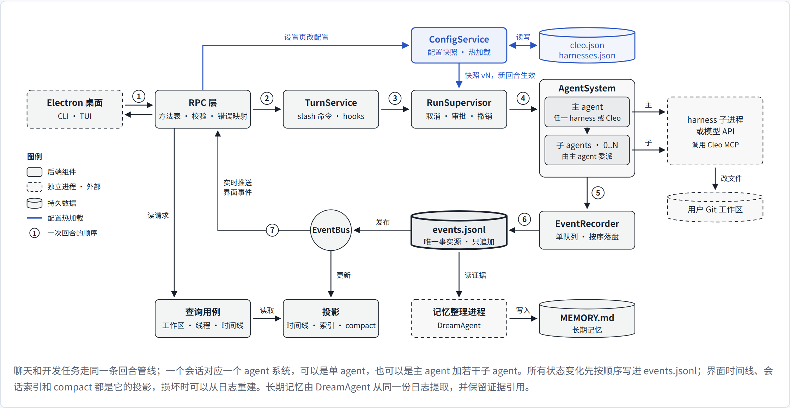

请求沿上排进去，事件沿下排回来：

1. 界面通过 JSONL 发来 `stream_turn`；同一条通道把事件行推回界面。
2. RPC 层按显式方法表校验参数，交给 TurnService。slash 命令和 hooks 在这里处理。
3. RunSupervisor 创建这次运行，绑定当前配置快照，负责 checkpoint、取消、审批和追加指令。
4. TurnEngine 执行：聊天走 LangGraph 调模型，开发任务走 Codex、Claude 或 ACP 子进程。
5. 所有引擎事件进入同一个有序队列。
6. EventRecorder 按顺序追加到 `events.jsonl`，它是唯一事实源。
7. EventBus 更新投影并实时推回界面；查询请求只读投影。

蓝色路径是配置热加载（第 15 节）。下面各节是这张图背后的细节。

## 0. 现状诊断（v0.7.1）

| # | 问题 | 证据 | 后果 |
| --- | --- | --- | --- |
| P1 | `DesktopService` 是上帝类 | `cleo/desktop/service.py` 3009 行、约 110 个方法；同时负责 workspace 查询、线程生命周期、聊天流、任务流、steering、rewind、Git 撤销、模型配置、订阅登录、harness 切换、进化限制、computer use、slash 命令、记忆审阅、计时 | 任何改动都牵动全局；测试只能白盒替换私有方法 |
| P2 | 运行期状态散落在 11 个可变字典 / 集合里 | `_run_tasks`、`_run_ids`、`_steering_runs`、`_pending_approvals`、`_run_workspaces`、`_productivity_sessions`、`_chat_agents`、`_harness_switches` … | 没有统一的 Run 生命周期，取消、清理与并发规则分散在 `finally` 块里 |
| P3 | 导入即加载的全局配置 | `cleo/config/settings.py` 末尾执行 `settings = load_settings()`；`agents/cleo.py`、`memory/store.py`、`agents/dream.py` 直接读取它 | 配置变更只能靠重启进程（Electron 现在就是这么做的）；测试必须靠环境变量隔离 |
| P4 | 反射式 RPC | `ProtocolServer` 用 `getattr(service, method)` 分发，任何公共协程都可调用 | 接口面不显式、没有参数 schema；允许列表只存在于 Electron |
| P5 | 聊天与任务是两套"回合"模型 | 聊天：回合结束后用 `sync_langchain_messages` 把 LangChain 状态差量落盘；任务：provider 事件实时落盘 | 两套持久化与投影规则，rewind、计时、steering 都要各写一遍 |
| P6 | 实时投影与持久化投影是两份代码 | `projection.stream_event_item` 与 `timeline_from_events` / `TimelineIndex` | 已出现分歧：ACP 工具在重新加载后显示为失败（快照 Q2） |
| P7 | `SessionStore` 职责过多 | 一次追加会顺带写 manifest、SQLite 索引、compact.json、memory DB 的 conversation chunks、memory_state | 副作用链隐式；索引只在缓存未命中时重建（Q5） |
| P8 | harness 能力靠鸭子类型探测 | `AgentService._capability(...)`、`getattr(provider, "rewind")`，以及 Desktop 里 `type in {"codex_sdk","claude_sdk"}` 之类的判断 | 新增 provider 时必须翻遍 Desktop 的类型判断 |
| P9 | 横切功能侵入核心 | `_is_evolution` / `_evolution_prompt` / `_restrict_evolution`、computer use、skills 展开都写在 `stream_turn` 里 | 核心流程难读，扩展无边界 |

**保留的优点**：

- `events.jsonl` 作为事实源；
- `space + project + session` 数据边界；
- `AgentProvider` 端口与 `SessionRepository` 端口（`cleo/harnesses/provider.py`、`cleo/sessions/ports.py`）；
- 原子写与 append-only 规则；
- DreamAgent 的证据约束与状态机。

## 1. 设计原则

1. **六边形架构（Ports & Adapters）+ 模块化单体**：按限界上下文分包，每个上下文内部分 domain / application / ports / infrastructure 四层。
2. **依赖只向内**：interfaces → application → domain。infrastructure 实现 ports，由 composition root 注入。domain 不做任何 I/O。
3. **一个回合管线**：聊天与任务共用 `TurnService → RunSupervisor → TurnEngine → EventRecorder → 投影/事件总线`，引擎是唯一的差异点。
4. **一份投影**：同一个纯函数 `TimelineProjector` 同时服务实时流和历史分页。
5. **能力显式化**：provider 声明能力集合，UI 的运行档案（runtime profile）由能力推导，不再判断 provider 类型。
6. **无导入期全局状态**：`Settings` 在启动时加载并注入；`Clock` / `IdGenerator` 也是端口，测试可以让输出确定。
7. **协议契约不变**：方法名、参数、结果、事件形状和错误 `name` 与 v0.7.1 一致，由特征测试守护。

## 2. 系统上下文（C4 Level 1）

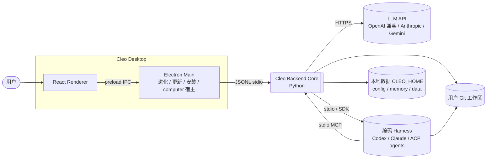
```mermaid
flowchart LR
    user([用户])
    subgraph desktop[Cleo Desktop]
        renderer[React Renderer]
        electron[Electron Main<br/>进化 / 更新 / 安装 / computer 宿主]
    end
    core[[Cleo Backend Core<br/>Python]]
    llm[(LLM API<br/>OpenAI 兼容 / Anthropic / Gemini)]
    harness[(编码 Harness<br/>Codex / Claude / ACP agents)]
    fs[(本地数据 CLEO_HOME<br/>config / memory / data)]
    git[(用户 Git 工作区)]

    user --> renderer
    renderer -- preload IPC --> electron
    electron -- JSONL stdio --> core
    core -- HTTPS --> llm
    core -- stdio / SDK --> harness
    harness -- stdio MCP --> core
    core --> fs
    core --> git
    harness --> git
```

## 3. 运行时进程与部署图

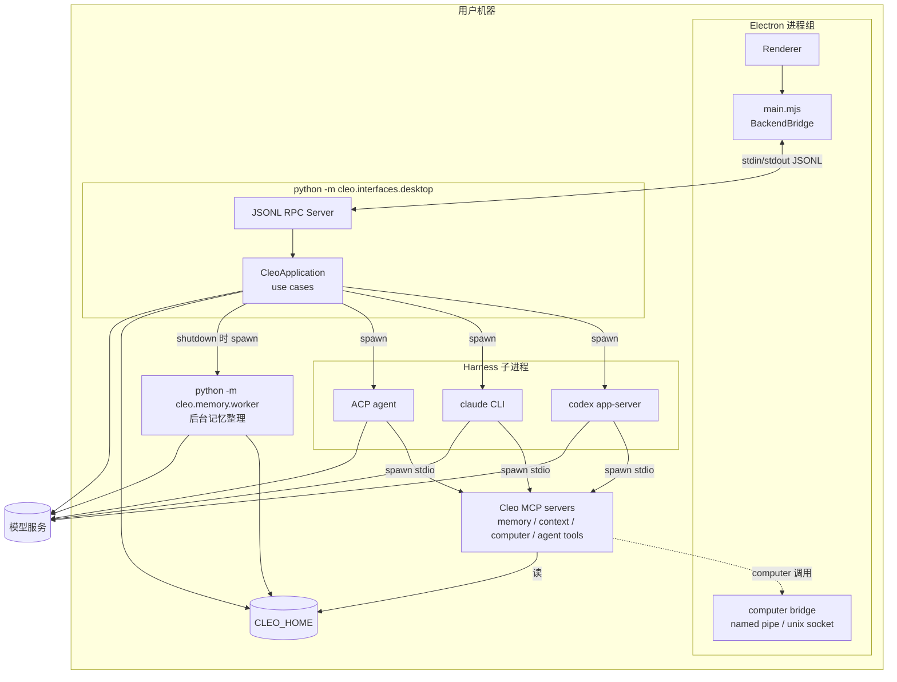
```mermaid
flowchart TB
    subgraph host[用户机器]
        subgraph el[Electron 进程组]
            main[main.mjs<br/>BackendBridge]
            rend[Renderer]
            bridge[computer bridge<br/>named pipe / unix socket]
        end
        subgraph py[python -m cleo.interfaces.desktop]
            rpc[JSONL RPC Server]
            app[CleoApplication<br/>use cases]
        end
        worker[python -m cleo.memory.worker<br/>后台记忆整理]
        subgraph hp[Harness 子进程]
            codex[codex app-server]
            claude[claude CLI]
            acp[ACP agent]
        end
        mcp[Cleo MCP servers<br/>memory / context / computer / agent tools]
        home[(CLEO_HOME)]
    end
    cloud[(模型服务)]

    rend --> main
    main <-- stdin/stdout JSONL --> rpc
    rpc --> app
    app -- spawn --> codex & claude & acp
    codex & claude & acp -- spawn stdio --> mcp
    mcp -- 读 --> home
    mcp -. computer 调用 .-> bridge
    app -- shutdown 时 spawn --> worker
    worker --> home
    app --> home
    app --> cloud
    worker --> cloud
    codex & claude & acp --> cloud
```

## 4. 分层与包结构

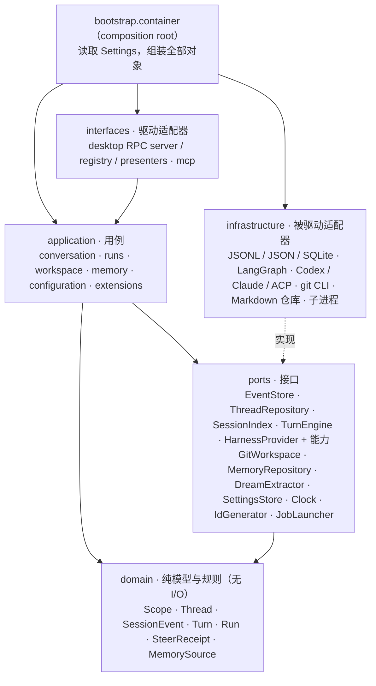
```mermaid
flowchart TB
    boot["bootstrap.container（composition root）<br/>读取 Settings，组装全部对象"]
    ifc["interfaces · 驱动适配器<br/>desktop RPC server / registry / presenters · mcp"]
    app["application · 用例<br/>conversation · runs · workspace · memory · configuration · extensions"]
    dom["domain · 纯模型与规则（无 I/O）<br/>Scope · Thread · SessionEvent · Turn · Run · SteerReceipt · MemorySource"]
    prt["ports · 接口<br/>EventStore · ThreadRepository · SessionIndex · TurnEngine · HarnessProvider + 能力<br/>GitWorkspace · MemoryRepository · DreamExtractor · SettingsStore · Clock · IdGenerator · JobLauncher"]
    inf["infrastructure · 被驱动适配器<br/>JSONL / JSON / SQLite · LangGraph · Codex / Claude / ACP · git CLI · Markdown 仓库 · 子进程"]

    boot --> ifc
    boot --> app
    boot --> inf
    ifc --> app
    app --> dom
    app --> prt
    prt --> dom
    inf -. 实现 .-> prt
```

目标目录（与现有模块的对应关系见下方映射表）：

```text
cleo/
├── kernel/            Scope、ID/Clock 端口、DomainError、DomainEvent、EventBus
├── conversation/      线程聚合、事件日志、回合、rewind、时间线投影与查询
├── runs/              Run 生命周期、steering、审批、提问、工作区并发守卫
├── engines/           TurnEngine 端口；chat/（LangGraph）与 harness/（AgentService + providers）
├── workspace/         项目登记、Git checkpoint、撤销、变更集
├── memory/            审阅队列、整理编排、DreamAgent 提取、Markdown+git 仓库、compact 投影
├── configuration/     设置模型、模型连接、harness 目录、AGENTS.md
├── extensions/        evolution / computer_use / skills / subscriptions / timing（插件）
├── interfaces/        desktop（RPC + presenters）/ mcp
└── bootstrap/         container.py（组装）、app.py（CleoApplication 门面）
```

现有模块到新包的映射：

| v0.7.1 模块 | 去向 |
| --- | --- |
| `desktop/server.py` | `interfaces/desktop/rpc_server.py` + `rpc_registry.py` |
| `desktop/service.py`（3009 行） | 拆分：查询类 → 各上下文的 application；`_thread` / `load_workspace` 的组装 → `interfaces/desktop/presenters`；运行期状态 → `runs/RunSupervisor`；slash 命令 → `CommandRegistry` |
| `desktop/projection.py`、`desktop/timeline.py` | `conversation/projection.py`（`TimelineProjector`）+ `conversation/infrastructure/sqlite_timeline_index.py` |
| `desktop/steering.py` | `runs/domain/steer.py` + `runs/application` |
| `desktop/configuration.py`、`desktop/task_harnesses.py` | `configuration/application` |
| `desktop/runtime_permissions.py` | `engines/harness/capabilities.py`（权限预设由能力推导） |
| `desktop/skills.py`、`desktop/subscription_login.py` | `extensions/skills`、`extensions/subscriptions` |
| `desktop/evolution_planning.py`、`desktop/release_repair.py`、`desktop/dependencies.py` | `extensions/evolution`；Electron 调用的 `-m` 入口保持原模块路径做转发 |
| `sessions/store.py` | `conversation/infrastructure`（`JsonlEventStore`、`JsonManifestRepository`、`SqliteSessionIndex`）+ 投影订阅者；保留 `SessionStore` 兼容门面 |
| `sessions/ports.py`、`policy.py`、`rewind.py` | `conversation/ports.py`、`conversation/domain` |
| `sessions/hub.py` | `engines/harness/native_history.py` |
| `harnesses/*` | `engines/harness`（service、context/handoff、approvals、questions） |
| `integrations/harnesses/*` | `engines/harness/providers` |
| `agents/cleo.py`、`agents/runtime.py`、`agents/tools/` | `engines/chat` |
| `agents/dream.py`、`memory/*` | `memory/`（domain / application / infrastructure） |
| `integrations/git.py`、`integrations/workspace.py` | `workspace/infrastructure` |
| `config/settings.py` | `configuration/domain`（模型）+ `JsonSettingsStore`；`cleo.config.settings.settings` 改为惰性兼容属性 |
| `runtime/state.py` | `workspace/infrastructure/runtime_json_store.py`（项目与最近线程） |
| `runtime/timing.py` | `extensions/timing` |
| `computer/*`、`integrations/computer.py` | `extensions/computer_use` |
| `mcp/*` | `interfaces/mcp`（`cleo-*-mcp` 脚本入口不变） |
| `cli/*`、`images/*`、`main.py`、Docker 应用镜像 | 已在 S0b 移除；后台记忆整理进程迁到 `cleo/memory/worker.py` |

## 5. 组件图

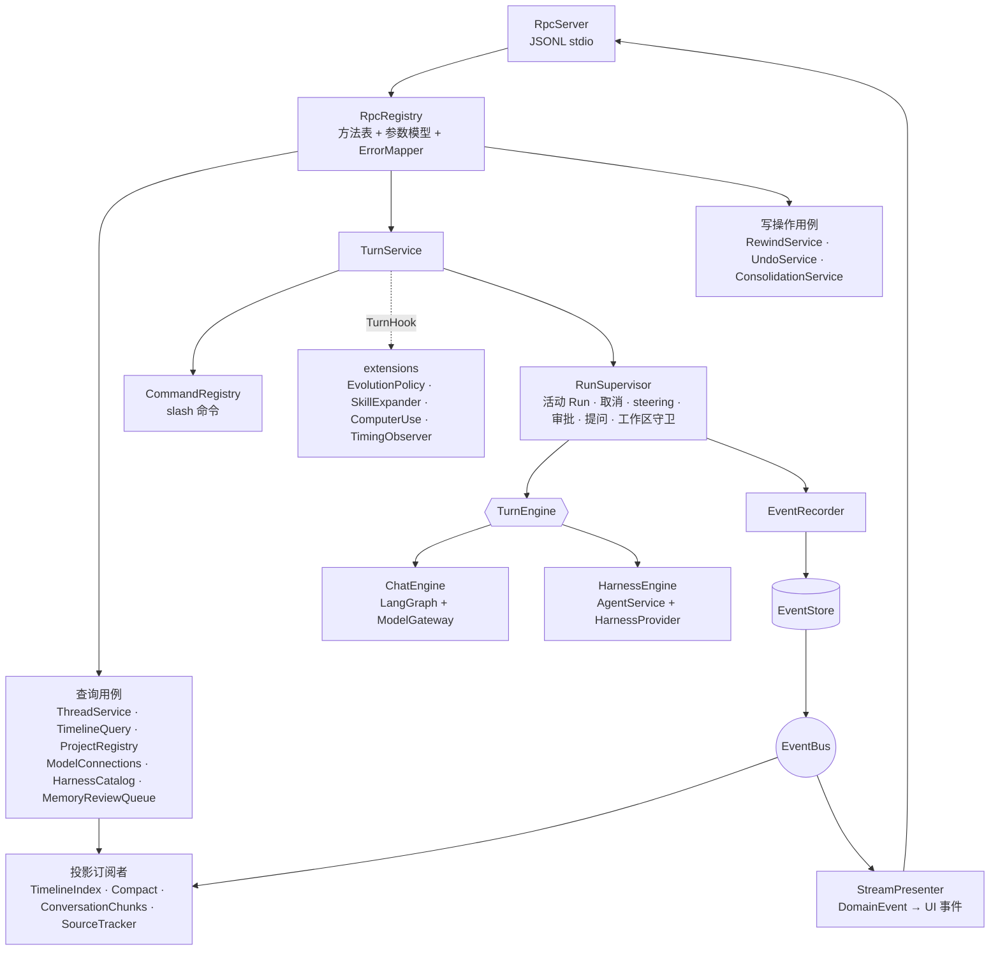
```mermaid
flowchart TB
    RS["RpcServer<br/>JSONL stdio"] --> RR["RpcRegistry<br/>方法表 + 参数模型 + ErrorMapper"]
    RR --> Q["查询用例<br/>ThreadService · TimelineQuery · ProjectRegistry<br/>ModelConnections · HarnessCatalog · MemoryReviewQueue"]
    RR --> TU["TurnService"]
    RR --> CMD["写操作用例<br/>RewindService · UndoService · ConsolidationService"]
    TU --> CR["CommandRegistry<br/>slash 命令"]
    TU -. TurnHook .-> EXT["extensions<br/>EvolutionPolicy · SkillExpander · ComputerUse · TimingObserver"]
    TU --> SUP["RunSupervisor<br/>活动 Run · 取消 · steering · 审批 · 提问 · 工作区守卫"]
    SUP --> TE{{"TurnEngine"}}
    TE --> CE["ChatEngine<br/>LangGraph + ModelGateway"]
    TE --> HE["HarnessEngine<br/>AgentService + HarnessProvider"]
    SUP --> ER["EventRecorder"] --> ES[("EventStore")]
    ES --> BUS(("EventBus"))
    BUS --> PJ["投影订阅者<br/>TimelineIndex · Compact · ConversationChunks · SourceTracker"]
    BUS --> SP["StreamPresenter<br/>DomainEvent → UI 事件"]
    Q --> PJ
    SP --> RS
```

## 6. 类图：领域模型

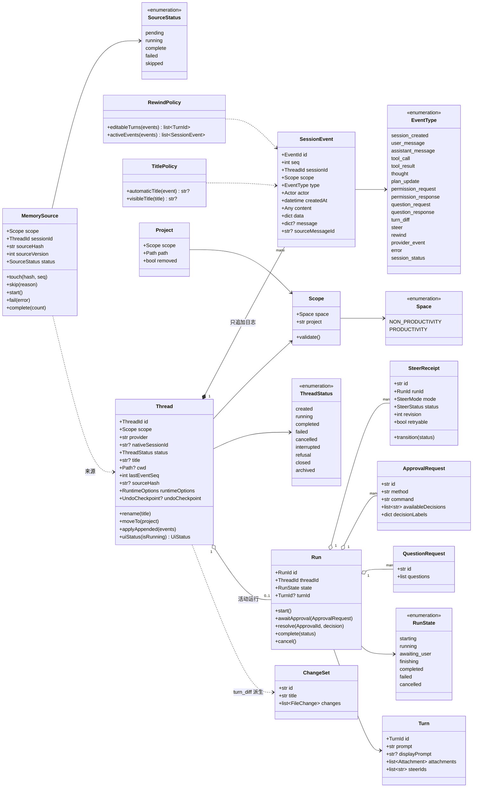
```mermaid
classDiagram
    direction LR
    class Scope {
        +Space space
        +str project
        +validate()
    }
    class Space {
        <<enumeration>>
        NON_PRODUCTIVITY
        PRODUCTIVITY
    }
    class Thread {
        +ThreadId id
        +Scope scope
        +str provider
        +str? nativeSessionId
        +ThreadStatus status
        +str? title
        +Path? cwd
        +int lastEventSeq
        +str? sourceHash
        +RuntimeOptions runtimeOptions
        +UndoCheckpoint? undoCheckpoint
        +rename(title)
        +moveTo(project)
        +applyAppended(events)
        +uiStatus(isRunning) UiStatus
    }
    class ThreadStatus {
        <<enumeration>>
        created
        running
        completed
        failed
        cancelled
        interrupted
        refusal
        closed
        archived
    }
    class SessionEvent {
        +EventId id
        +int seq
        +ThreadId sessionId
        +Scope scope
        +EventType type
        +Actor actor
        +datetime createdAt
        +Any content
        +dict data
        +dict? message
        +str? sourceMessageId
    }
    class EventType {
        <<enumeration>>
        session_created
        user_message
        assistant_message
        tool_call
        tool_result
        thought
        plan_update
        permission_request
        permission_response
        question_request
        question_response
        turn_diff
        steer
        rewind
        provider_event
        error
        session_status
    }
    class Turn {
        +TurnId id
        +str prompt
        +str? displayPrompt
        +list~Attachment~ attachments
        +list~str~ steerIds
    }
    class RewindPolicy {
        +editableTurns(events) list~TurnId~
        +activeEvents(events) list~SessionEvent~
    }
    class TitlePolicy {
        +automaticTitle(event) str?
        +visibleTitle(title) str?
    }
    class Run {
        +RunId id
        +ThreadId threadId
        +RunState state
        +TurnId? turnId
        +start()
        +awaitApproval(ApprovalRequest)
        +resolve(ApprovalId, decision)
        +complete(status)
        +cancel()
    }
    class RunState {
        <<enumeration>>
        starting
        running
        awaiting_user
        finishing
        completed
        failed
        cancelled
    }
    class SteerReceipt {
        +str id
        +RunId runId
        +SteerMode mode
        +SteerStatus status
        +int revision
        +bool retryable
        +transition(status)
    }
    class ApprovalRequest {
        +str id
        +str method
        +str command
        +list~str~ availableDecisions
        +dict decisionLabels
    }
    class QuestionRequest {
        +str id
        +list questions
    }
    class Project {
        +Scope scope
        +Path path
        +bool removed
    }
    class ChangeSet {
        +str id
        +str title
        +list~FileChange~ changes
    }
    class MemorySource {
        +Scope scope
        +ThreadId sessionId
        +str sourceHash
        +int sourceVersion
        +SourceStatus status
        +touch(hash, seq)
        +skip(reason)
        +start()
        +fail(error)
        +complete(count)
    }
    class SourceStatus {
        <<enumeration>>
        pending
        running
        complete
        failed
        skipped
    }

    Thread "1" *-- "many" SessionEvent : 只追加日志
    Thread --> Scope
    Scope --> Space
    Thread --> ThreadStatus
    SessionEvent --> EventType
    Thread "1" o-- "0..1" Run : 活动运行
    Run "1" o-- "many" SteerReceipt
    Run "1" o-- "many" ApprovalRequest
    Run "1" o-- "many" QuestionRequest
    Run --> RunState
    Run --> Turn
    RewindPolicy ..> SessionEvent
    TitlePolicy ..> SessionEvent
    Project --> Scope
    Thread ..> ChangeSet : turn_diff 派生
    MemorySource --> SourceStatus
    MemorySource ..> Thread : 来源
```

## 7. 类图：端口与适配器

### 7.1 持久化与基础设施端口

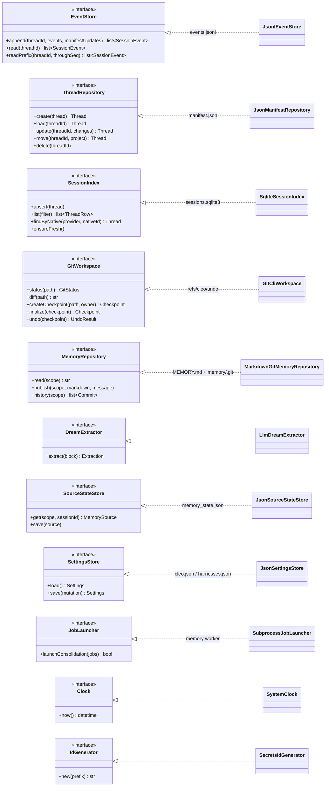
```mermaid
classDiagram
    direction LR
    class EventStore {
        <<interface>>
        +append(threadId, events, manifestUpdates) list~SessionEvent~
        +read(threadId) list~SessionEvent~
        +readPrefix(threadId, throughSeq) list~SessionEvent~
    }
    class ThreadRepository {
        <<interface>>
        +create(thread) Thread
        +load(threadId) Thread
        +update(threadId, changes) Thread
        +move(threadId, project) Thread
        +delete(threadId)
    }
    class SessionIndex {
        <<interface>>
        +upsert(thread)
        +list(filter) list~ThreadRow~
        +findByNative(provider, nativeId) Thread
        +ensureFresh()
    }
    class GitWorkspace {
        <<interface>>
        +status(path) GitStatus
        +diff(path) str
        +createCheckpoint(path, owner) Checkpoint
        +finalize(checkpoint) Checkpoint
        +undo(checkpoint) UndoResult
    }
    class MemoryRepository {
        <<interface>>
        +read(scope) str
        +publish(scope, markdown, message)
        +history(scope) list~Commit~
    }
    class DreamExtractor {
        <<interface>>
        +extract(block) Extraction
    }
    class SourceStateStore {
        <<interface>>
        +get(scope, sessionId) MemorySource
        +save(source)
    }
    class SettingsStore {
        <<interface>>
        +load() Settings
        +save(mutation) Settings
    }
    class JobLauncher {
        <<interface>>
        +launchConsolidation(jobs) bool
    }
    class Clock {
        <<interface>>
        +now() datetime
    }
    class IdGenerator {
        <<interface>>
        +new(prefix) str
    }
    EventStore <|.. JsonlEventStore : events.jsonl
    ThreadRepository <|.. JsonManifestRepository : manifest.json
    SessionIndex <|.. SqliteSessionIndex : sessions.sqlite3
    GitWorkspace <|.. GitCliWorkspace : refs/cleo/undo
    MemoryRepository <|.. MarkdownGitMemoryRepository : MEMORY.md + memory/.git
    DreamExtractor <|.. LlmDreamExtractor
    SourceStateStore <|.. JsonSourceStateStore : memory_state.json
    SettingsStore <|.. JsonSettingsStore : cleo.json / harnesses.json
    JobLauncher <|.. SubprocessJobLauncher : memory worker
    Clock <|.. SystemClock
    IdGenerator <|.. SecretsIdGenerator
```

### 7.2 回合引擎与 harness 能力

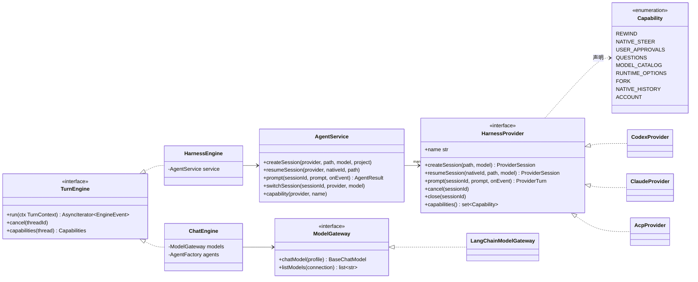
```mermaid
classDiagram
    direction LR
    class TurnEngine {
        <<interface>>
        +run(ctx TurnContext) AsyncIterator~EngineEvent~
        +cancel(threadId)
        +capabilities(thread) Capabilities
    }
    class ChatEngine {
        -ModelGateway models
        -AgentFactory agents
    }
    class HarnessEngine {
        -AgentService service
    }
    class ModelGateway {
        <<interface>>
        +chatModel(profile) BaseChatModel
        +listModels(connection) list~str~
    }
    class AgentService {
        +createSession(provider, path, model, project)
        +resumeSession(provider, nativeId, path)
        +prompt(sessionId, prompt, onEvent) AgentResult
        +switchSession(sessionId, provider, model)
        +capability(provider, name)
    }
    class HarnessProvider {
        <<interface>>
        +name str
        +createSession(path, model) ProviderSession
        +resumeSession(nativeId, path, model) ProviderSession
        +prompt(sessionId, prompt, onEvent) ProviderTurn
        +cancel(sessionId)
        +close(sessionId)
        +capabilities() set~Capability~
    }
    class Capability {
        <<enumeration>>
        REWIND
        NATIVE_STEER
        USER_APPROVALS
        QUESTIONS
        MODEL_CATALOG
        RUNTIME_OPTIONS
        FORK
        NATIVE_HISTORY
        ACCOUNT
    }
    TurnEngine <|.. ChatEngine
    TurnEngine <|.. HarnessEngine
    ChatEngine --> ModelGateway
    ModelGateway <|.. LangChainModelGateway
    HarnessEngine --> AgentService
    AgentService --> "many" HarnessProvider
    HarnessProvider ..> Capability : 声明
    HarnessProvider <|.. CodexProvider
    HarnessProvider <|.. ClaudeProvider
    HarnessProvider <|.. AcpProvider
```

每个能力对应一个可选协议（如 `SupportsRewind.rewind(...)`、`SupportsNativeSteer.steer(...)`）。下表是 v0.7.1 各 provider 实际实现的能力，由代码核对得出：

| 能力 | Codex | Claude | ACP | UI 中的体现 |
| --- | --- | --- | --- | --- |
| `REWIND` | ✓ | ✓ | — | `editableTurnIds`、编辑历史消息 |
| `NATIVE_STEER` | ✓ | — | — | `steerMode: native`（其余为 `boundary`） |
| `USER_APPROVALS` | ✓ | ✓ | ✓ | 审批卡片 |
| `QUESTIONS` | ✓ | ✓ | — | `supportsQuestions` |
| `MODEL_CATALOG` | ✓ | ✓ | ✓ | 模型选择器 |
| `RUNTIME_OPTIONS` | ✓ model / effort / sandbox / approval / speed | ✓ model / effort / permission | ✓ model / effort / approval | `permissionOptions`、`supportsFastMode` |
| `FORK` / `NATIVE_HISTORY` / `ACCOUNT` | ✓ | — | — | `/fork`、`/native`、`/account` |

## 8. 类图：应用服务与接口层

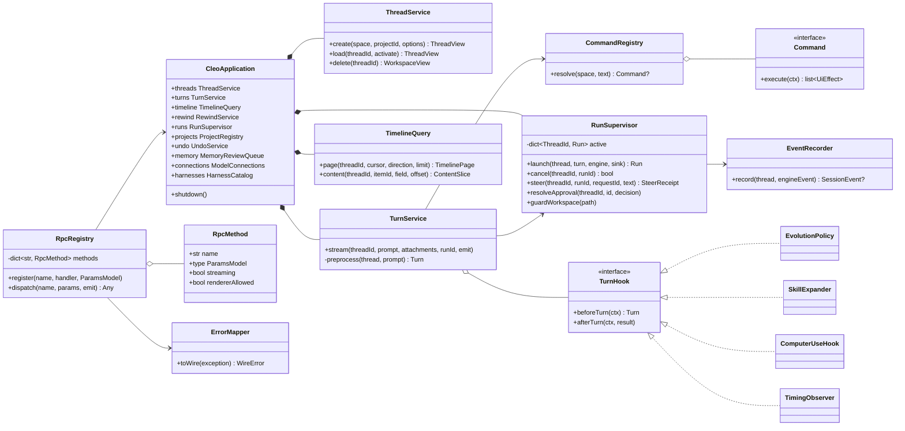
```mermaid
classDiagram
    direction LR
    class CleoApplication {
        +threads ThreadService
        +turns TurnService
        +timeline TimelineQuery
        +rewind RewindService
        +runs RunSupervisor
        +projects ProjectRegistry
        +undo UndoService
        +memory MemoryReviewQueue
        +connections ModelConnections
        +harnesses HarnessCatalog
        +shutdown()
    }
    class RpcRegistry {
        -dict~str, RpcMethod~ methods
        +register(name, handler, ParamsModel)
        +dispatch(name, params, emit) Any
    }
    class RpcMethod {
        +str name
        +type ParamsModel
        +bool streaming
        +bool rendererAllowed
    }
    class ErrorMapper {
        +toWire(exception) WireError
    }
    class ThreadService {
        +create(space, projectId, options) ThreadView
        +load(threadId, activate) ThreadView
        +delete(threadId) WorkspaceView
    }
    class TurnService {
        +stream(threadId, prompt, attachments, runId, emit)
        -preprocess(thread, prompt) Turn
    }
    class CommandRegistry {
        +resolve(space, text) Command?
    }
    class Command {
        <<interface>>
        +execute(ctx) list~UiEffect~
    }
    class RunSupervisor {
        -dict~ThreadId, Run~ active
        +launch(thread, turn, engine, sink) Run
        +cancel(threadId, runId) bool
        +steer(threadId, runId, requestId, text) SteerReceipt
        +resolveApproval(threadId, id, decision)
        +guardWorkspace(path)
    }
    class EventRecorder {
        +record(thread, engineEvent) SessionEvent?
    }
    class TimelineQuery {
        +page(threadId, cursor, direction, limit) TimelinePage
        +content(threadId, itemId, field, offset) ContentSlice
    }
    class TurnHook {
        <<interface>>
        +beforeTurn(ctx) Turn
        +afterTurn(ctx, result)
    }
    class EvolutionPolicy
    class SkillExpander
    class ComputerUseHook
    class TimingObserver

    RpcRegistry o-- RpcMethod
    RpcRegistry --> ErrorMapper
    RpcRegistry --> CleoApplication
    CleoApplication *-- ThreadService
    CleoApplication *-- TurnService
    CleoApplication *-- RunSupervisor
    CleoApplication *-- TimelineQuery
    TurnService --> CommandRegistry
    CommandRegistry o-- Command
    TurnService --> RunSupervisor
    TurnService o-- TurnHook
    TurnHook <|.. EvolutionPolicy
    TurnHook <|.. SkillExpander
    TurnHook <|.. ComputerUseHook
    TurnHook <|.. TimingObserver
    RunSupervisor --> EventRecorder
```

`RpcMethod.rendererAllowed` 让 Python 侧拥有与 `ui/electron/main.mjs` 允许列表一致的元数据。Electron 可以在启动时读取，不必再手工同步两份列表。

## 9. 时序图

### 9.1 聊天回合（chat space）

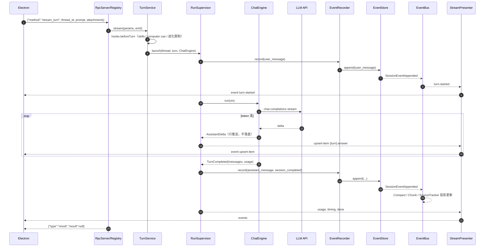
```mermaid
sequenceDiagram
    autonumber
    participant E as Electron
    participant R as RpcServer/Registry
    participant T as TurnService
    participant S as RunSupervisor
    participant C as ChatEngine
    participant L as LLM API
    participant ER as EventRecorder
    participant ES as EventStore
    participant B as EventBus
    participant P as StreamPresenter

    E->>R: {"method":"stream_turn", thread_id, prompt, attachments}
    R->>T: stream(params, emit)
    T->>T: hooks.beforeTurn（skills / computer use / 进化限制）
    T->>S: launch(thread, turn, ChatEngine)
    S->>ER: record(user_message)
    ER->>ES: append(user_message)
    ES-->>B: SessionEventAppended
    B-->>P: turn-started
    P-->>E: event turn-started
    S->>C: run(ctx)
    C->>L: chat.completions stream
    loop token 流
        L-->>C: delta
        C-->>S: AssistantDelta（只推送，不落盘）
        S-->>P: upsert-item {turn}:answer
        P-->>E: event upsert-item
    end
    C-->>S: TurnCompleted(messages, usage)
    S->>ER: record(assistant_message, session_completed)
    ER->>ES: append(...)
    ES-->>B: SessionEventAppended
    B-->>B: Compact / Chunk / SourceTracker 投影更新
    S-->>P: usage, timing, done
    P-->>E: events
    R-->>E: {"type":"result","result":null}
```

### 9.2 开发任务回合 + 用户审批

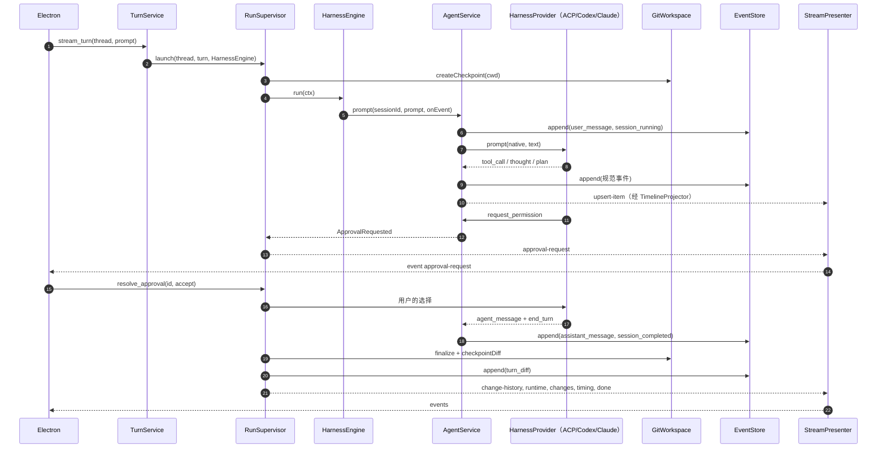
```mermaid
sequenceDiagram
    autonumber
    participant E as Electron
    participant T as TurnService
    participant S as RunSupervisor
    participant H as HarnessEngine
    participant A as AgentService
    participant V as HarnessProvider（ACP/Codex/Claude）
    participant G as GitWorkspace
    participant ES as EventStore
    participant P as StreamPresenter

    E->>T: stream_turn(thread, prompt)
    T->>S: launch(thread, turn, HarnessEngine)
    S->>G: createCheckpoint(cwd)
    S->>H: run(ctx)
    H->>A: prompt(sessionId, prompt, onEvent)
    A->>ES: append(user_message, session_running)
    A->>V: prompt(native, text)
    V-->>A: tool_call / thought / plan
    A->>ES: append(规范事件)
    A-->>P: upsert-item（经 TimelineProjector）
    V->>A: request_permission
    A-->>S: ApprovalRequested
    S-->>P: approval-request
    P-->>E: event approval-request
    E->>S: resolve_approval(id, accept)
    S->>V: 用户的选择
    V-->>A: agent_message + end_turn
    A->>ES: append(assistant_message, session_completed)
    S->>G: finalize + checkpointDiff
    S->>ES: append(turn_diff)
    S-->>P: change-history, runtime, changes, timing, done
    P-->>E: events
```

### 9.3 编辑历史消息（rewind）

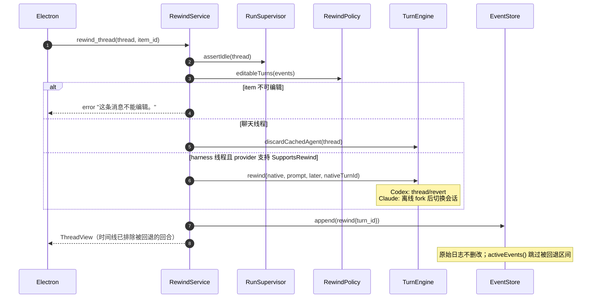
```mermaid
sequenceDiagram
    autonumber
    participant E as Electron
    participant RV as RewindService
    participant S as RunSupervisor
    participant RP as RewindPolicy
    participant EN as TurnEngine
    participant ES as EventStore

    E->>RV: rewind_thread(thread, item_id)
    RV->>S: assertIdle(thread)
    RV->>RP: editableTurns(events)
    alt item 不可编辑
        RV-->>E: error "这条消息不能编辑。"
    else 聊天线程
        RV->>EN: discardCachedAgent(thread)
    else harness 线程且 provider 支持 SupportsRewind
        RV->>EN: rewind(native, prompt, later, nativeTurnId)
        Note over EN: Codex: thread/revert<br/>Claude: 离线 fork 后切换会话
    end
    RV->>ES: append(rewind{turn_id})
    RV-->>E: ThreadView（时间线已排除被回退的回合）
    Note over ES: 原始日志不删改；activeEvents() 跳过被回退区间
```

### 9.4 优雅关闭与后台记忆整理

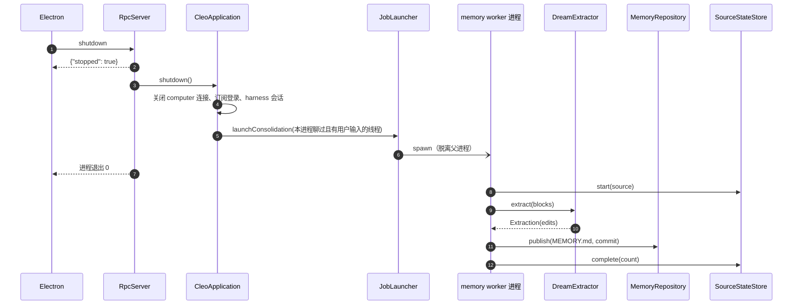
```mermaid
sequenceDiagram
    autonumber
    participant E as Electron
    participant R as RpcServer
    participant APP as CleoApplication
    participant J as JobLauncher
    participant W as memory worker 进程
    participant D as DreamExtractor
    participant M as MemoryRepository
    participant SS as SourceStateStore

    E->>R: shutdown
    R-->>E: {"stopped": true}
    R->>APP: shutdown()
    APP->>APP: 关闭 computer 连接、订阅登录、harness 会话
    APP->>J: launchConsolidation(本进程聊过且有用户输入的线程)
    J-)W: spawn（脱离父进程）
    R-->>E: 进程退出 0
    W->>SS: start(source)
    W->>D: extract(blocks)
    D-->>W: Extraction(edits)
    W->>M: publish(MEMORY.md, commit)
    W->>SS: complete(count)
```

### 9.5 启动与组装（composition root）

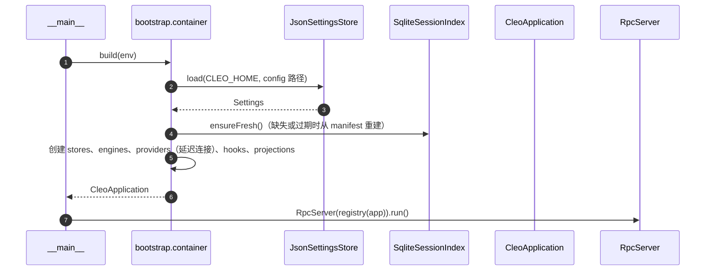
```mermaid
sequenceDiagram
    autonumber
    participant M as __main__
    participant BC as bootstrap.container
    participant SET as JsonSettingsStore
    participant IDX as SqliteSessionIndex
    participant APP as CleoApplication
    participant R as RpcServer

    M->>BC: build(env)
    BC->>SET: load(CLEO_HOME, config 路径)
    SET-->>BC: Settings
    BC->>IDX: ensureFresh()（缺失或过期时从 manifest 重建）
    BC->>BC: 创建 stores、engines、providers（延迟连接）、hooks、projections
    BC-->>M: CleoApplication
    M->>R: RpcServer(registry(app)).run()
```

## 10. 状态图

### 10.1 Run 生命周期

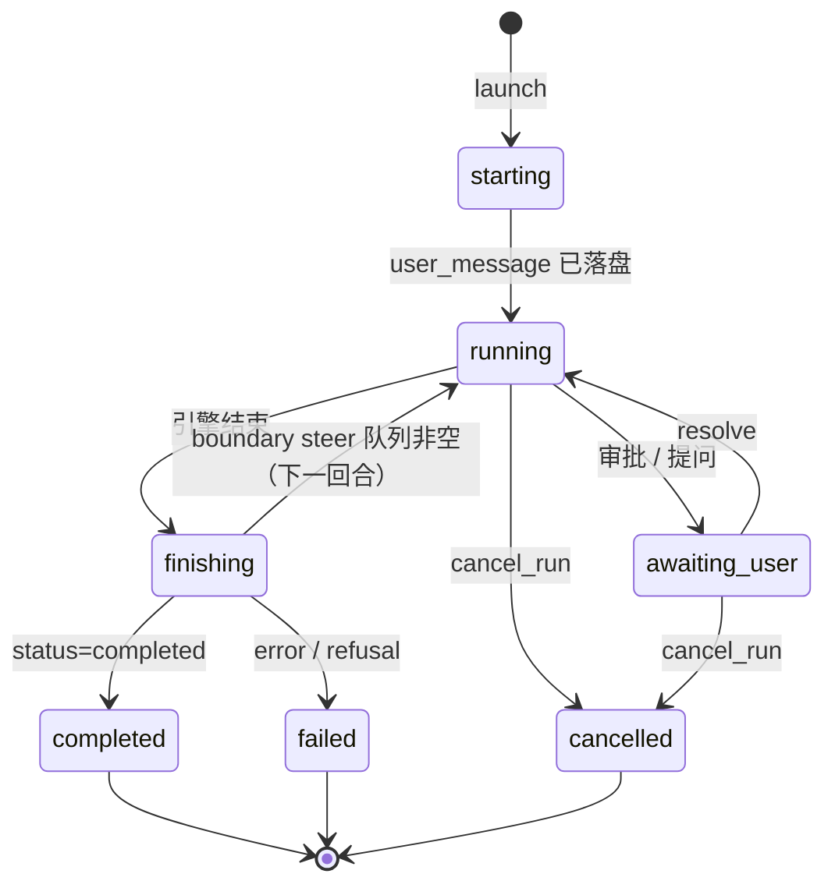
```mermaid
stateDiagram-v2
    [*] --> starting: launch
    starting --> running: user_message 已落盘
    running --> awaiting_user: 审批 / 提问
    awaiting_user --> running: resolve
    running --> finishing: 引擎结束
    finishing --> completed: status=completed
    finishing --> failed: error / refusal
    running --> cancelled: cancel_run
    awaiting_user --> cancelled: cancel_run
    finishing --> running: boundary steer 队列非空（下一回合）
    completed --> [*]
    failed --> [*]
    cancelled --> [*]
```

### 10.2 线程状态到 UI 状态

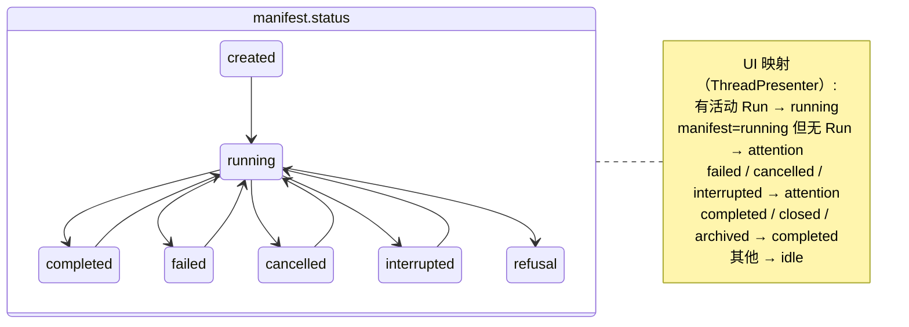
```mermaid
stateDiagram-v2
    direction LR
    state "manifest.status" as ms {
        created --> running
        running --> completed
        running --> failed
        running --> cancelled
        running --> interrupted
        running --> refusal
        completed --> running
        failed --> running
        cancelled --> running
        interrupted --> running
    }
    note right of ms
        UI 映射（ThreadPresenter）:
        有活动 Run → running
        manifest=running 但无 Run → attention
        failed / cancelled / interrupted → attention
        completed / closed / archived → completed
        其他 → idle
    end note
```

### 10.3 记忆来源（MemorySource）

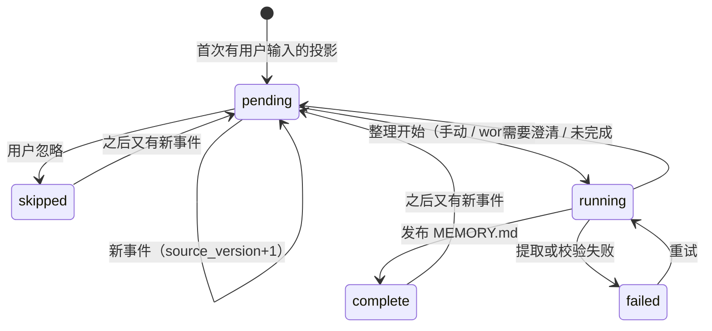
```mermaid
stateDiagram-v2
    [*] --> pending: 首次有用户输入的投影
    pending --> pending: 新事件（source_version+1）
    pending --> skipped: 用户忽略
    pending --> running: 整理开始（手动 / worker）
    failed --> running: 重试
    running --> complete: 发布 MEMORY.md
    running --> failed: 提取或校验失败
    running --> pending: 需要澄清 / 未完成
    complete --> pending: 之后又有新事件
    skipped --> pending: 之后又有新事件
```

### 10.4 Steer 回执

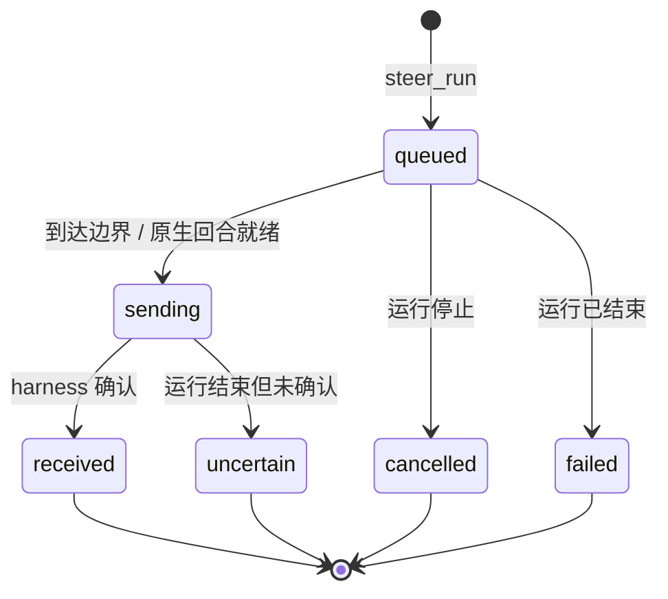
```mermaid
stateDiagram-v2
    [*] --> queued: steer_run
    queued --> sending: 到达边界 / 原生回合就绪
    sending --> received: harness 确认
    sending --> uncertain: 运行结束但未确认
    queued --> cancelled: 运行停止
    queued --> failed: 运行已结束
    received --> [*]
    uncertain --> [*]
    cancelled --> [*]
    failed --> [*]
```

## 11. 关键设计决策

| 决策 | 选项 | 选择与理由 |
| --- | --- | --- |
| RPC 分发 | 反射 vs 显式注册表 | **显式注册表 + Pydantic 参数模型**。方法名不变，所以特征测试不受影响；`ErrorMapper` 保持现有 `name`（例如 `ValueError`、`FileNotFoundError`），因为快照固定了它 |
| 聊天持久化 | 回合结束后同步 LangChain 状态 vs 实时记录 | 第一阶段**保留** `sync_langchain_messages` 的落盘形状（快照固定了 `message` 字段与 `lc_run--` ID）；把它封装进 `ChatEngine` 的 `TurnCompleted` 事件，由 `EventRecorder` 统一写入 |
| 投影 | 两份 vs 一份 | **一份 `TimelineProjector`**。重构阶段先让新实现逐字复现两种旧输出，再作为独立行为变更修复 Q2/Q3 并更新快照 |
| 配置 | 全局单例 vs 注入 vs 热加载快照 | **带版本号的配置快照加热加载**（第 15 节）。每个 Run 绑定启动时的快照；数据目录类字段仍需重启。Electron 在后端声明 `hotReload` 后不再重启后端 |
| harness 能力 | 鸭子类型 vs 声明 | **能力协议 + `capabilities()`**。runtime profile 的 `editable`、`supportsQuestions`、`steerMode`、`permissionOptions` 由能力推导 |
| 进化 / computer use / skills | 写在核心里 vs 插件 | **`TurnHook` 插件**。核心回合管线不再出现 evolution 分支 |
| 索引 | 缓存未命中时重建 vs 启动时校验 | 启动时 `ensureFresh()`。这会改变 Q5 的行为，属于行为变更，单独提交 |
| provider 事件并发 | 回调里直接落盘 vs 有序队列 | **每个 Run 一个单消费者有序队列**：provider 回调只负责入队；`EventRecorder` 按到达顺序串行落盘并推送；`prompt` 返回后先排空队列，再写终态事件。这能消除 Q11，但会改变 ACP 的时序，所以放在 S9 单独提交 |
| Git 失败的可见性 | 只写调试日志 vs 领域事件 | `GitWorkspace` 失败时返回明确的结果类型，`RunSupervisor` 把它变成 `notice`（例如"这一轮无法撤销：路径过长"），不再静默丢弃。同时把 undo ref 名缩短为截断的 hash，修复 Q12 |
| 会话与 agent 的关系 | 一个会话一个 agent vs agent 系统 | **会话绑定 `AgentSystemSpec`**：单 agent 是退化情况；router 模式由主 agent 通过 `cleo_agents` MCP 委派子 agent（第 16 节）。M0 只引入接口，行为不变 |

## 12. 特征测试与新组件的对应

| 新组件 | 守护它的快照 |
| --- | --- |
| RpcServer / RpcRegistry / ErrorMapper | `protocol/*`，以及每个测试的错误分支 |
| WorkspacePresenter / ProjectRegistry | `workspace/fresh_home`、`workspace/projects`、`legacy/workspace` |
| ModelConnections / JsonSettingsStore | `workspace/model_connections`、`workspace/catalogs`、`workspace/agent_instructions` |
| TurnService / RunSupervisor / ChatEngine / EventRecorder | `chat/first_turn`、`chat/resume_after_restart`、`chat/model_failure`、`chat/validation_errors`、`chat/attachments`、`protocol/cancel_chat_run` |
| HarnessEngine / AgentService / AcpProvider | `productivity/*`、`entrypoints/harness_handoff` |
| RewindService / RewindPolicy | `chat/rewind`、`legacy/continue_chat`、`formats/projections_chat` |
| CommandRegistry | `chat/slash_commands`、`productivity/slash_commands` |
| UndoService / GitWorkspace | `productivity/undo`、`productivity/tool_turn` |
| TimelineProjector / TimelineQuery | `legacy/timeline_paging`、`formats/projections_*`、所有 `reloaded_*` 字段 |
| JsonlEventStore / JsonManifestRepository / SqliteSessionIndex | `*/disk` 字段、`legacy/*`、`formats/*` 哈希 |
| MemoryReviewQueue / ConsolidationService / JobLauncher | `memory/*`、`legacy/memory` |
| MCP 接口 | `entrypoints/*` |

## 13. 迁移路线（Strangler Fig，每一步都保持特征测试为绿）


```mermaid
flowchart LR
    s0[S0 基线<br/>特征测试 51 个通过] --> s0b[S0b 移除 CLI]
    s0b --> s1[S1 Composition root<br/>Settings 延迟加载与注入]
    s1 --> s1b[S1b 配置快照与热加载]
    s1b --> s2[S2 显式 RpcRegistry<br/>ErrorMapper]
    s2 --> s3[S3 拆 SessionStore<br/>EventStore / Manifests / Index / 投影]
    s3 --> s4[S4 RunSupervisor<br/>收拢运行期状态]
    s4 --> s4b[S4b Presenters<br/>Workspace / Thread 视图]
    s4b --> s5[S5 AgentSystem 接口<br/>先实现单 agent]
    s5 --> s6[S6 CommandRegistry + TurnHooks<br/>evolution / skills / computer / timing]
    s6 --> s7[S7 TimelineProjector 单一实现]
    s7 --> s8[S8 能力协议<br/>runtime profile 由能力推导]
    s8 --> s9[S9 行为修复<br/>Q1–Q12 逐项更新快照]
```

| 步骤 | 主要移动 | 风险 | 验证 |
| --- | --- | --- | --- |
| S0b | 移除终端 CLI/TUI、`cleo/images`、`main.py` 与 Docker 应用镜像；后台记忆整理进程迁到 `cleo/memory/worker.py`；打包不再带 CLI 启动图 | 遗漏依赖 CLI 的代码 | 特征测试中 CLI 入口快照改为后端进程入口快照，其余不变 |
| S1 | 新建 `bootstrap/container.py`，`load_settings()` 改为显式调用；保留 `cleo.config.settings.settings` 作为惰性兼容属性。Clock 和 ID 生成器的注入推迟到 S3/S4，在真正改到那些代码时再做 | 导入顺序 | 全部特征测试；`tests/test_boundaries.py` |
| S1b | `ConfigService` 与 `SettingsSnapshot`；`settings` 兼容对象改为按 `ContextVar` 解析的代理；`load_workspace.backend` 增加 `hotReload` 与 `config` 状态；Electron 按标记停止重启后端 | 运行中读到新旧配置混用；provider 旧实例泄漏 | 全部特征测试保持不变（`load_workspace` 快照只多出 `hotReload` 与 `config` 字段），另加 `test_hot_reload.py`（第 15 节） |
| S2 | `ProtocolServer` 改用 `cleo/desktop/rpc.py` 的显式方法表：每个方法标明调用方（`renderer` / `main` / `unused`）和是否流式；handler 仍是 `DesktopService` 的同名方法，调用时查找，参数原样传入，所以参数错误仍是原来的 `TypeError`。Pydantic 参数模型会改变错误名，留到 S9。没有调用方的 `analyze_evolution_request` 暂时保留并标为 `unused` | 漏注册方法 | `protocol/*`；`tests/desktop/test_rpc_registry.py` 核对方法表与 `DesktopService` 公开方法、`allowedMethods` 以及 Electron 主进程中的调用 |
| S3 | `SessionStore` 门面保留，存储拆到 `cleo/sessions/` 下的 `manifests.JsonManifestRepository`、`event_log.JsonlEventStore`、`index.SqliteSessionIndex`、`compact.CompactProjection` 与 `messages`；门面只保留跨存储的规则：事件与 manifest 的写入顺序、fsync、身份校验、何时刷新投影。投影刷新改为事件总线订阅会改变 `compact.json` 的更新时机，与 S5 的 `EventRecorder` 一起做 | 落盘顺序、fsync 规则 | `*/disk`、`legacy/*`、`formats/*`；`tests/sessions/test_storage_parts.py` |
| S4 | `cleo/desktop/runs.py` 的 `RunSupervisor` 接管原先散在 `DesktopService` 上的 8 项运行期状态（任务、run id、steering、待审批、各运行的工作区及其锁、运行参数锁、进行中的 harness 切换），以及开始/结束/取消运行、切换互斥、工作区占用判断。回合管线仍在 `stream_turn` 中，S5 再拆；聊天 agent 缓存和开发会话缓存属于执行引擎，随 S5 移动 | 取消与清理竞态 | `protocol/cancel_chat_run`、`productivity/cancel_and_refusal`、`productivity/boundary_steering` |
| S4b | Workspace / Thread 的 UI 映射从 `DesktopService` 移到 Presenters。线程视图要读运行状态（运行中、steering、待审批），所以放在 RunSupervisor 之后，通过它的只读接口取得 | 字段遗漏 | `workspace/*`、`legacy/workspace`、所有 `reloaded_*` |
| S5 | `_stream_chat` / `_stream_productivity` 变为成员执行方式（`AgentRuntime`），外面包一层 `AgentSystem` 接口，只实现 `SingleAgentSystem`（第 16 节 M0） | 事件顺序 | `chat/*`、`productivity/*` |
| S6 | 两段 if/elif 命令链改为 `Command` 类；evolution 等改为 hook | 命令文案 | `*/slash_commands` |
| S7 | 统一投影；先逐字复现旧输出 | 实时与重新加载差异 | `reloaded_*`、`legacy/timeline_paging` |
| S8 | provider 声明能力 | runtime profile 字段 | `workspace/catalogs`、`productivity/runtime_options` |
| S9 | 修复 Q1–Q12（含 Run 有序事件队列、undo ref 缩短与 Git 失败提示），每项独立 PR，并审阅快照 diff | 有意的行为变更 | 更新对应快照 |

## 14. 不变量清单（重构期间必须保持）

1. `events.jsonl` 只追加；`seq` 从 1 严格递增；同一 `id` 幂等。
2. `event_content_hash` 的规范 JSON 算法不变（`sort_keys`、紧凑分隔符、`ensure_ascii=False`）。
3. 每个事件都带 `space/project/session_id`，与 manifest 一致；两个 space 互不串数据。
4. 协议 stdout 只输出 JSON 行；API key 不出现在任何协议输出中。
5. 流式 token 只推送、不落盘；完成的语义消息才落盘。
6. rewind 只追加标记，不删改原始记录；时间线、聊天回放、harness 交接上下文和记忆压缩都跳过被回退区间。
7. DreamAgent 只能从有证据引用的来源发布偏好；手动忽略不等于已整理。
8. 配置写入是原子的；返回 UI 的模型设置只含 `hasApiKey`。

## 15. 配置热加载

### 重构前（v0.7.1）

- 21 个模块在导入时直接读全局配置 `cleo.config.settings.settings`；`agents/cleo.py` 甚至在模块加载时把当前模型固定为 `active_profile`。
- Electron 每次修改模型连接或 DreamAgent 设置后都会重启后端（S1b 起只对没有 `hotReload` 标记的后端这样做，见 `ui/electron/main.mjs:455`）。
- 只有 AGENTS.md 已经是即时生效的：保存后清空聊天 agent 缓存，下一回合从日志重建。

### 哪些可以热加载

| 立即生效（新回合起） | 仍需重启 |
| --- | --- |
| 模型连接、API Key、当前聊天模型；DreamAgent 模型与开关；`harnesses.json` 的 provider 增删改与默认 provider；工具设置（浏览器、搜索 Key、shell 白名单）；AGENTS.md | 数据目录 profile（`root_dir`、`memory_dir`、会话索引路径等）；`CLEO_HOME` 与配置文件路径。修改这类字段时，新值保存到文件，进程继续使用旧值，并回报 `restartRequired` |

### 机制

| 环节 | 设计 |
| --- | --- |
| 快照 | `ConfigService` 持有不可变的 `SettingsSnapshot(version, settings)`。写入流程是：加锁，重读文件，应用修改，整体校验，原子写入，版本加 1，替换快照，发布 `SettingsChanged(diff)` |
| 外部编辑 | 每个 RPC 请求进来时先 `stat` 两个配置文件，比较 mtime 和大小，有变化就重载；校验失败保留旧快照，并通过 `load_workspace.backend.config.error` 告诉界面。不需要额外的文件监视线程 |
| 按运行绑定 | RunSupervisor 启动运行时把快照写进 `ContextVar`；`cleo.config.settings.settings` 改为代理对象：运行内读这次运行的快照，运行外读最新快照。`asyncio.to_thread` 会复制上下文，工具线程读到的版本也一致；21 个旧导入点不必逐个修改 |
| 聊天引擎 | 缓存的聊天 agent 记录自己创建时的配置版本；配置变化后，下一回合重建 agent，历史从日志恢复。已有线程的模型由其 `chat_profile` 固定（v0.7.1 起如此），只有 API Key 等凭据跟随连接更新 |
| Harness | `HarnessCatalog` 对 provider 配置做 diff：新增或修改的生成新实例，供新会话使用；已打开的原生会话继续使用旧实例，关闭后释放；被禁用的 provider 不能再创建新任务。harness 启动的 MCP 子进程从下一个会话起使用新配置 |
| 并发写入 | 写入时带上版本号；如果文件已被外部修改，先重载再应用修改，避免两个窗口互相覆盖 |
| Electron 兼容 | 后端在 `load_workspace.backend` 中声明 `hotReload: true`，Electron 看到后不再重启后端。进化功能可能切换到较旧的后端版本，旧版本没有这个标记，Electron 就继续重启 |

### S1b 实现情况

S1b 按上表落地，但先用现有模块承载，后续步骤再搬到目标位置：

| 目标设计 | S1b 中的位置 |
| --- | --- |
| `ConfigService` / `SettingsSnapshot` | `cleo/config/service.py`；在组合根 `cleo/bootstrap/container.py` 创建 |
| 发布 `SettingsChanged(diff)` | `subscribe(listener)`，回调参数为 `(old, new)`；回调出错时写入 `config.error`，不影响服务 |
| RunSupervisor 绑定快照 | 暂由 `DesktopService.stream_turn` 调用 `ConfigService.bind_run()`；S5 移到 RunSupervisor |
| `HarnessCatalog` diff | `integrations/harnesses/factory.py::sync_providers`，配合 `AgentService.register(replace=True)` / `unregister` |
| 外部编辑检测 | `ProtocolServer` 在分发每个请求前调用 `refresh_if_changed()` |
| 并发写入 | 六个配置写入方法本来就先从磁盘读文件再修改，外部编辑不会被覆盖；暂不引入版本号令牌 |

配置文件被删除时只报告错误，不会像启动时那样写入默认模板。

### 测试

现有的 `workspace/model_connections` 测试在修改后会重启后端，热加载上线后照样通过，用来确认修改已经落盘。`load_workspace` 快照多了 `backend.hotReload` 与 `backend.config` 两个字段。新增的 `test_hot_reload.py` 覆盖：

1. 协议保存的连接和外部编辑，不重启即可进入 runtime catalog 和下一回合；
2. 运行中的回合继续使用开始时的配置；同一线程的下一回合重建 agent，工具设置随新配置变化，模型仍按线程创建时记录的 `chat_profile`（v0.7.1 行为），新对话使用新模型；
3. 外部写入无效 JSON 或无效取值时保留旧配置，并在 workspace 中报告错误，错误中不含输入值；
4. 修改数据目录时回报需要重启，当前进程行为不变，改回后标记清除；
5. `harnesses.json` 新增的 provider 可以直接建任务，禁用后不能再建。

`tests/config/test_config_service.py` 与 `tests/integrations/test_harness_factory.py` 从单元层面覆盖同样的规则。

"运行中禁止修改连接"这条现有限制（`_require_idle_configuration`），S1b 先保留。有了快照隔离之后可以放开，但放开属于行为变更，在 S9 单独提交。

## 16. 会话 Agent 系统（多 agent）

目标：一个会话不再固定对应一个 agent，而是对应一个 **agent 系统**。agent 数量不定：

- **单 agent**：与现在完全相同；
- **router 多 agent**：一个**主 agent** 负责整个流程，并把子任务委派给若干**子 agent**。子 agent 可以是任意外部 harness 或 SDK，例如 Codex 做主 agent，把实现交给 Claude Code，把审阅交给某个 ACP agent，结果再交回 Codex。

用户只和主 agent 对话。

### 16.1 概念

| 概念 | 含义 |
| --- | --- |
| `AgentSystemSpec` | 会话绑定的 agent 系统规格：`mode`（`single` / `router`）、`main`、`members[]`、`limits`。创建会话时选定，空闲时可以更换（与现在切换 harness 的规则相同） |
| `AgentMember` | 一个可对话的执行体：agent 实现（Codex、Claude、ACP harness 或 Cleo 内置 LangGraph agent）加上模型与权限参数、角色描述（供主 agent 选择）、工作区隔离方式。每个成员在会话里有自己的原生会话，第一次用到时创建，之后跨回合复用，所以子 agent 记得之前接过的任务 |
| `Delegation` | 主 agent 发起的一次子任务：`queued → running → completed / failed / cancelled / needs_input`，带结果摘要和子会话引用 |
| router | 路由由主 agent 通过工具调用决定（LLM 路由）。将来如需确定性路由（例如 `/review` 直接交给审阅成员），可以在 TurnService 前面加一个可选的 `RoutingPolicy`，不影响这套结构 |

### 16.2 主 agent 怎么调用子 agent

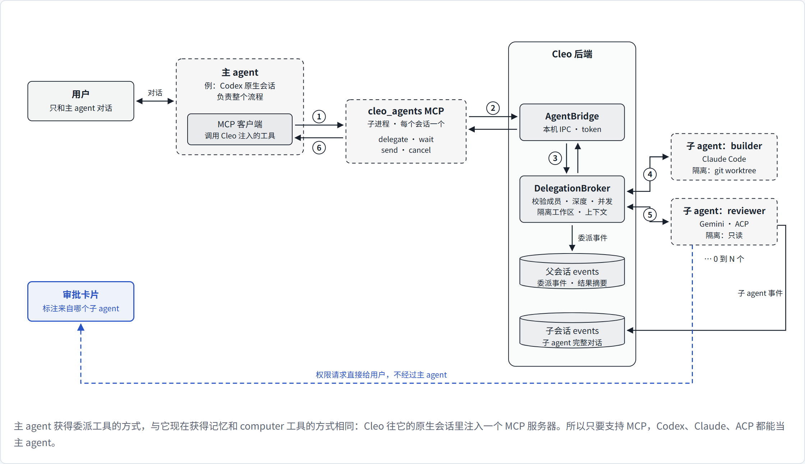

1. Cleo 给主 agent 的原生会话多挂一个 MCP 服务器 `cleo_agents`。注入方式与现在的 `cleo_memory` / `cleo_computer` 相同：Codex 用 config overrides，Claude 用 `mcp_servers`，ACP 用 `session/new` 的 `mcpServers`。因此任何支持 MCP 的 harness 都能当主 agent。工具有五个：
   - `list_agents()`：可用成员、角色、隔离方式和当前状态；
   - `delegate(agent, task, context_refs?, wait)`：等待完成后返回结果，或立即返回委派 ID；
   - `wait(ids, timeout)`：并行扇出时收集结果；
   - `send(id, message)`：追加指令，或回答子 agent 的提问；
   - `cancel(id)`：取消委派。
2. MCP 服务器是 harness 拉起的子进程，没法直接调用后端，所以由后端开一个 **AgentBridge**（本机 IPC：Windows 命名管道或 Unix socket，带 token）。MCP 服务器带着会话的 client key 连上来，后端据此定位到哪个会话的哪次运行。这与现在 computer bridge 的模式相同，只是服务端在 Python 后端而不在 Electron。
3. **DelegationBroker**（应用层）负责：
   - 校验成员、深度、并发和预算；
   - 准备工作区隔离；
   - 给子 agent 绑定主会话的上下文快照，子 agent 通过 `cleo_context` MCP 按需读取，直接复用 harness 交接的机制；
   - 启动子 agent 回合，收集结果并返回。
4. 结果作为工具返回值交给主 agent，主 agent 继续自己的流程。

如果 Cleo 内置的 LangGraph agent 做主 agent，同样五个工具以进程内 LangChain tool 的形式提供，替换现在的 `codex` / `codex_reply` 工具。

**长任务**：harness 对单次 MCP 工具调用有超时（Cleo 给 computer 工具设的是 660 秒）。`delegate(wait=true)` 等到上限时会返回"仍在运行"和委派 ID，主 agent 再用 `wait` 继续等。

### 16.3 运行与数据

| 方面 | 设计 |
| --- | --- |
| 运行 | 一次用户回合仍是一个 Run。Run 下面有多个活动：主 agent 活动，加上每个委派一个活动。取消运行时级联取消所有活动。主 agent 的回合结束时，默认取消还没完成的委派，保证运行有边界 |
| 子会话 | 每个成员有一个**子会话**：普通 manifest 加 `events.jsonl`，`parent_session_id` 指向主会话，带 `delegate` 标签和 `agent_id`。它保存子 agent 的完整对话，所以恢复、rewind、compact 这些现有机制可以原样复用 |
| 父会话日志 | 新增事件类型：`delegation_requested` / `started` / `completed` / `failed` / `cancelled`，记录子会话 ID 和结果摘要。所有事件可选带 `data.agent_id`，不带就表示主 agent |
| 兼容 | manifest 新增 `agent_system` 字段。旧 manifest 没有它，按 `single` 处理，顶层的 `provider` / `native_session_id` 就是主 agent。时间线投影会忽略不认识的事件类型，所以旧版本读到多 agent 会话时只是看不到委派卡片；子会话在旧版本里会显示成普通线程，新版本按标签隐藏 |
| 记忆 | 记忆审阅队列只放主会话；DreamAgent 以主会话为来源，可以按引用读取子会话的证据 |

### 16.4 工作区、审批与提问

| 方面 | 默认规则 | 理由 |
| --- | --- | --- |
| 工作区隔离 | 写代码的子 agent 用 `worktree`：每个委派在独立的 git worktree 里工作，完成后以补丁或分支形式交给主 agent，由主 agent 决定是否合并。审阅、调研类子 agent 用 `read_only`。`shared`（同一目录）只在显式配置时使用，并且同一时间只允许一个可写活动 | 多个 harness 同时写同一个仓库会互相覆盖；现有的 undo checkpoint 遇到共享工作区时已经会放弃撤销 |
| worktree 位置 | 放在 `CLEO_HOME/worktrees/<短 ID>` 下 | 避开 Windows 长路径问题（Q12） |
| 权限请求 | 子 agent 的权限请求**不经过主 agent**，直接进入用户的审批卡片，标注来自哪个子 agent。每个成员可以单独设置审批策略，例如只读成员设为 `deny_all` | 不能让一个 AI 替用户批准另一个 AI 的越权操作 |
| 提问 | 子 agent 的提问（Claude 的 AskUserQuestion、Codex 的 requestUserInput）以 `needs_input` 结果返回给主 agent，由主 agent 自己回答或转问用户 | 符合"用户只和主 agent 交互" |
| 追加指令 | 用户的追加指令只发给主 agent；主 agent 用 `send` 转给子 agent | 同上 |
| 递归 | 深度默认为 1：子 agent 拿不到 `cleo_agents`，不能再往下委派 | 防止循环委派和成本失控 |
| 限额 | 并发数、每回合委派次数、单次超时都有默认值，用户可以在设置里调整（见 16.5）；token 预算作为后续可选项 | 多个 harness 并行会同时消耗多份订阅或 token；不同用户的订阅额度和机器性能不同，固定值不合适 |

### 16.5 配置与限额（用户可调，支持热加载）

#### 限额

| 设置 | 含义 | 默认值 | 允许范围 | 超出时的行为 |
| --- | --- | --- | --- | --- |
| `max_parallel` 同时运行的子 agent 数 | 一个会话里同时处于运行中的委派数，排队中的不算 | 2 | 1–8 | 新委派进入排队，`delegate` 返回 `queued`；有空位时按发起顺序启动 |
| `max_delegations_per_turn` 每回合委派上限 | 一次用户回合内，主 agent 最多发起的委派次数 | 6 | 1–50 | 拒绝这次委派，并把原因作为工具结果告诉主 agent（"本回合委派已达 6 次上限，可在设置中调整"），由主 agent 自己收尾 |
| `timeout_min` 单次委派超时 | 一个委派最长运行多久 | 30 分钟 | 1–240 | 取消该委派，结果为 `failed: timeout` |

默认值和范围是建议值，落地前可以再调。

- **两层设置**：设置页"多 agent"里有全局默认值；每个预设可以单独覆盖其中某几项；会话使用它所选预设的值。
- **生效时机**：保存后立即写入配置文件（热加载），从下一回合开始生效；正在运行的回合继续使用它启动时的配置快照，不会中途改变规则。
- **校验**：超出范围的值保存时会被拒绝，界面提示合法范围；手动改文件写入非法值时保留旧值并报错，与第 15 节的热加载规则一致。
- **计数规则**：只计这个会话的委派。不同会话之间暂不设总上限；如果以后需要限制整台机器上同时运行的 harness 数，再加一个全局值。

#### 配置文件（`agent-systems.json`）

```json
{
  "defaults": {
    "limits": { "max_parallel": 2, "max_delegations_per_turn": 6, "timeout_min": 30 },
    "blocked": [
      { "provider": "claude", "model": "claude-opus" },
      { "provider": "grok" }
    ]
  },
  "presets": {
    "codex-lead": {
      "mode": "router",
      "main": { "provider": "codex", "model": "gpt-5.5" },
      "members": [
        { "id": "builder", "provider": "claude", "role": "实现与重构", "isolation": "worktree" },
        { "id": "reviewer", "provider": "gemini", "role": "代码审阅", "isolation": "read_only",
          "approval": "deny_all" }
      ],
      "limits": { "max_parallel": 3 }
    }
  }
}
```

上例中 `codex-lead` 只覆盖了并发数，其余两项沿用全局默认值；`blocked` 是全局黑名单（见 16.6），可以写到 harness 级别，也可以写到 harness 的某个模型。创建任务时选择一个 provider（单 agent）或一个预设。

这些设置放在单独的 `agent-systems.json`，不放进 harnesses.json：旧版本读取 harnesses.json 时会拒绝未知字段（`ProductivitySettings` 设置了 `extra="forbid"`），而进化功能可能切回旧版本。

### 16.6 谁可以当子 agent

结论：**以预设里的成员名单作为白名单，主 agent 在名单内自由选择，再加一个可选的全局黑名单兜底。**不采用纯黑名单，也不要求用户每次重新配置。

| 层 | 作用 | 由谁决定 |
| --- | --- | --- |
| 成员名单（白名单） | 预设里列出的成员才可能被委派。成员的粒度是"harness + 模型 + 权限/隔离方式 + 角色描述"。新建预设时，Cleo 列出已安装且已登录的 harness 供用户勾选 | 用户，配置一次后反复使用 |
| 主 agent 路由 | 每个任务交给哪个成员，由主 agent 根据 `list_agents` 返回的角色描述和状态决定 | 主 agent |
| 模型固定 | 主 agent 只能选成员，不能改成员的模型，避免它自己把子任务升级到最贵的模型。以后如果需要，可以让成员声明几个允许的模型（`allowed_models`）供主 agent 挑选 | 用户（成员配置） |
| 全局黑名单（可选） | `blocked` 列出永远不当子 agent 的 harness，或某个 harness 的某个模型，对所有预设生效，主要用于成本控制。黑名单优先于预设：命中的成员在界面上显示为"已被全局禁用"，不会出现在 `list_agents` 里。它只限制子 agent，不影响谁当主 agent | 用户（设置页） |
| 会话内临时开关 | 在当前会话的运行设置里临时停用某个成员，不必修改预设；记录在 manifest 的 `agent_system.disabled_members` 中 | 用户，随时调整 |

**为什么不用纯黑名单**：

- Cleo 现在会把 claude、gemini、copilot、grok、opencode 这几个内置 harness 预设默认列为可用（`cleo/desktop/task_harnesses.py::task_providers`），即使它们没有安装。
- 如果默认全放开，主 agent 会去调用没装或没登录的 harness；以后新加的 ACP agent 也会在用户不知情的情况下自动变成可委派对象。

**为什么白名单不增加负担**：主 agent 本来就需要每个成员的角色描述才能选得准，所以成员名单是这套机制的必需品，不是额外的配置。

`list_agents` 只返回同时满足以下条件的成员：在名单里、未被黑名单命中、未在本会话停用、当前可用（已安装、已登录）。不可用的成员会带上原因，方便主 agent 换人。

### 16.7 协议与界面（只增不改）

- 时间线新增条目类型 `delegation`：`agentId`、`agentLabel`、`task`、`status`、`summary`、`childThreadId`、`changes`。条目可选带 `agentId`；子会话的实时事件以 `parentItemId` 挂在委派卡片下，默认折叠，可以展开看子 agent 的完整过程。
- `approval-request` 带上 `agentId`；runtime profile 增加 `agentSystem`（模式、主 agent、成员及状态）。
- 新 RPC：
  - `get_agent_systems`：返回全局默认值、允许范围、黑名单、各个预设，以及可供勾选的已安装且已登录的 harness；
  - `save_agent_system_defaults(limits, blocked)`：保存全局默认值和黑名单；
  - `save_agent_system(preset)`：保存一个预设，可以带上它自己覆盖的限额；
  - `update_agent_system(thread_id, preset_id, disabled_members)`：会话空闲时切换预设，或临时停用某些成员。
- 查看子 agent 的完整对话时，复用 `load_timeline(childThreadId)`。

### 16.8 在架构中的位置

- 总图里的 TurnEngine 换成 `AgentSystem` 接口，有两个实现：`SingleAgentSystem`（现在的行为）和 `RouterAgentSystem`（主 agent 加委派）。
- 原来的 ChatEngine 和 HarnessEngine 下沉为成员的执行方式（`AgentRuntime`），同一个接口既可以当主 agent，也可以当子 agent。
- 新组件：`DelegationBroker`（应用层）、`AgentBridge`、`cleo_agents` MCP 服务器（接口层）。
- RunSupervisor 从"一个运行一个活动"扩展为"一个运行多个活动"。

### 16.9 落地顺序

| 阶段 | 内容 | 用户可见变化 | 测试 |
| --- | --- | --- | --- |
| M0（并入 S5） | TurnEngine 改为 `AgentSystem` 接口，只实现 `SingleAgentSystem`；事件 schema 允许可选的 `agent_id` | 无 | 51 个特征测试保持不变 |
| M1（S9 之后） | 子会话、DelegationBroker、AgentBridge、`cleo_agents` MCP；`delegate` 与 `wait` 支持并行，受 `max_parallel` 限制；只读与共享隔离，共享目录下的写入者仍逐个执行；三项限额及设置页的数值调整；成员白名单、全局黑名单与会话内停用；审批冒泡到用户；界面加委派卡片 | 可以选择多 agent 预设，并调整并发数等限额 | 新增特征测试：假 ACP agent 同时当主 agent（通过 MCP 客户端调用 `delegate`）和子 agent，固定委派事件、子会话、工具返回值，超出并发时排队、超出次数时拒绝，以及被黑名单命中或停用的成员不出现在 `list_agents` 中 |
| M2 | worktree 隔离与合并（并行写代码）、`send` 与提问路由 | 多个子 agent 可以同时改代码 | worktree 合并、取消的级联 |
| M3 | Cleo 内置 agent 作为主 agent 或成员；设置页里编辑完整预设（成员、角色、隔离方式）；预算与成本显示 | 预设编辑 | 预设的热加载 |

### 16.10 需要决定的点

| 问题 | 推荐 | 备选 |
| --- | --- | --- |
| 子 agent 的权限请求 | 冒泡给用户 | 成员级自动策略（只适合只读成员） |
| 主回合结束时还没完成的委派 | 取消 | 后台继续，结果并入下一回合 |
| 写代码子 agent 的默认隔离 | worktree | 共享目录加写锁 |
| 子 agent 完整对话是否可在界面查看 | 默认折叠，可以展开 | 只显示结果摘要 |
| agent 系统预设放在哪里 | 单独的 `agent-systems.json` | harnesses.json 新增字段（需要旧版本兼容） |
